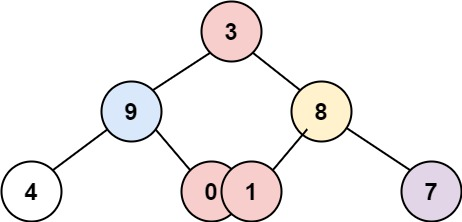

#  Binary Tree Vertical Order Traversal

Given the `root` of a binary tree, return **the vertical order traversal** of its nodes' values. (i.e., from top to bottom, column by column).

If two nodes are in the same row and column, the order should be from **left to right**.

 

**Example 1:**


```
Input: root = [3,9,20,null,null,15,7]
Output: [[9],[3,15],[20],[7]]
```

**Example 2:**


```
Input: root = [3,9,8,4,0,1,7]
Output: [[4],[9],[3,0,1],[8],[7]]
```

**Example 3:**


```
Input: root = [3,9,8,4,0,1,7,null,null,null,2,5]
Output: [[4],[9,5],[3,0,1],[8,2],[7]]
``` 

**Constraints:**

- The number of nodes in the tree is in the range `[0, 100]`.
- `-100 <= Node.val <= 100`

```
/**
 * Definition for a binary tree node.
 * function TreeNode(val, left, right) {
 *     this.val = (val===undefined ? 0 : val)
 *     this.left = (left===undefined ? null : left)
 *     this.right = (right===undefined ? null : right)
 * }
 */
/**
 * @param {TreeNode} root
 * @return {number[][]}
 */
var verticalOrder = function(root) {    
    var q  = [];
    
    if (root) q.push([root, 0]);    
    
    var negCols = [], posCols = [];   
    
    while(q.length) {
        for (var i = 0; i < q.length; i++) {
             var [n, d] = q.shift(),
                 colIndex = d < 0  ? -(d + 1) : d,
                 cols = d < 0 ? negCols : posCols;
            
            // if we have seen this column then append to the group otherwise expand given cols list.
            if (colIndex < cols.length) {
                cols[colIndex].push(n.val);
             } else {
                cols.push([n.val]);
             }
             
             if (n.left) q.push([n.left, d - 1]);    
             if (n.right) q.push([n.right, d + 1]);              
        }
    }
    
    return negCols.reverse().concat(posCols);
};

```